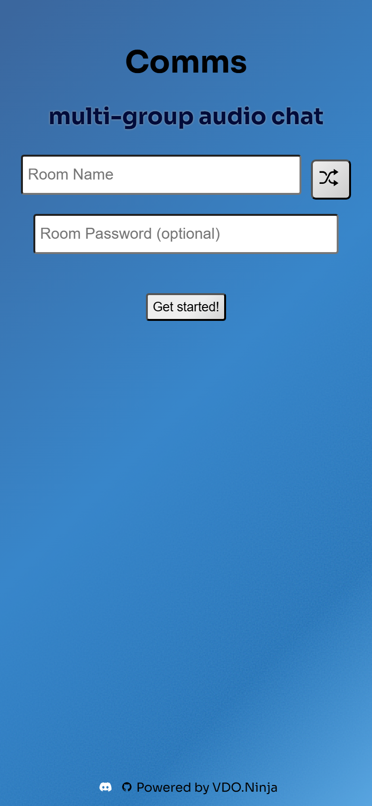
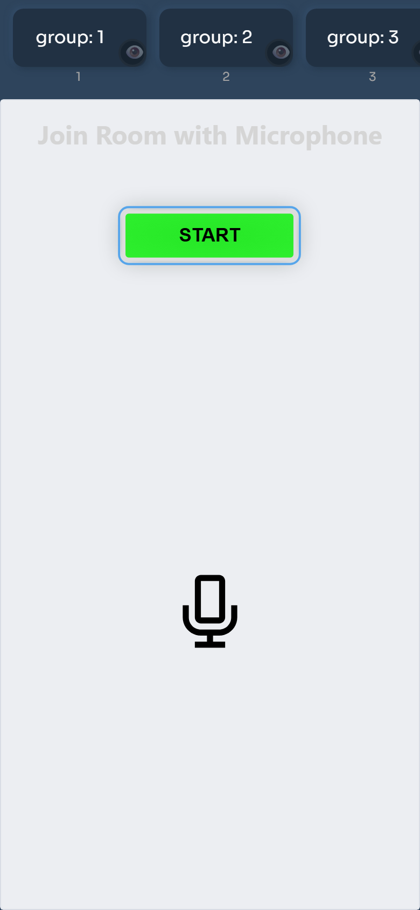
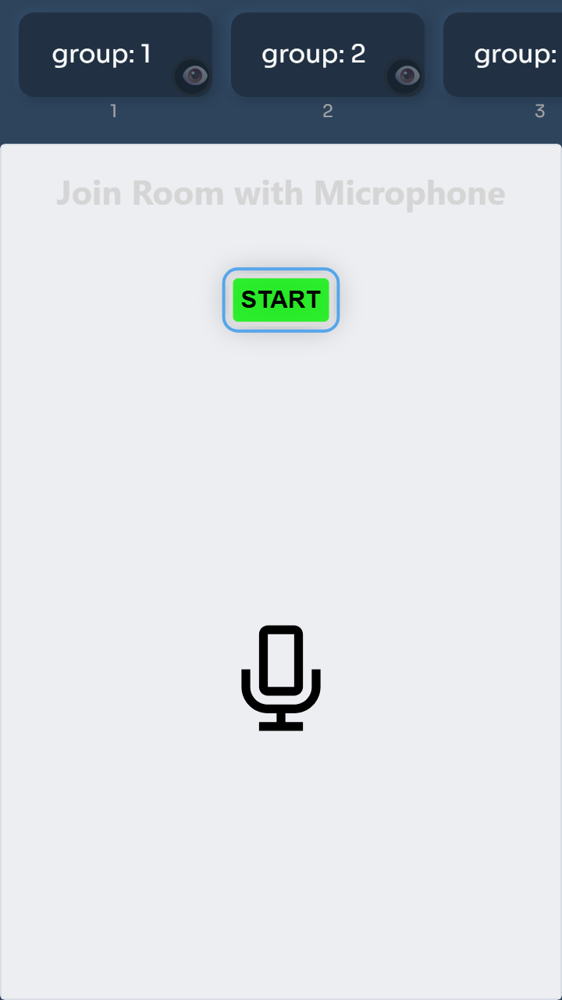
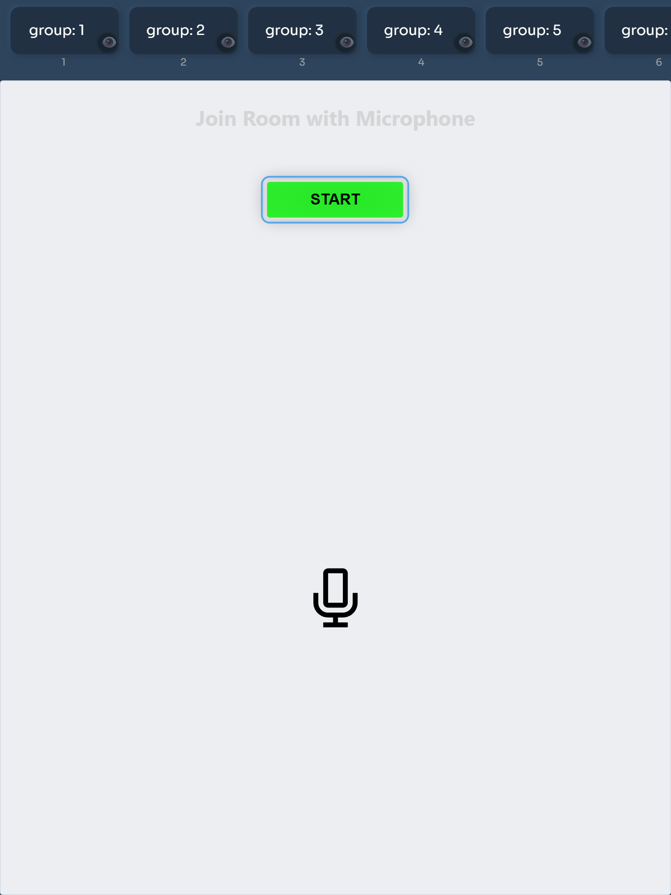

# Comms.cam

Multi-group audio chat for production crews, powered by VDO.Ninja.

Comms.cam is a lightweight interface for audio-only production comms. It wraps
VDO.Ninja group-room controls with large group buttons, optional text chat, and
mobile-friendly controls for joining and switching talk/listen groups.

## Try It

- App: https://comms.cam/
- VDO.Ninja docs: https://docs.vdo.ninja/steves-helper-apps/comms
- VDO.Ninja source: https://github.com/steveseguin/vdo.ninja

## Features

- Multi-group audio rooms
- Quick group switching
- View-only group monitoring
- Optional room password
- Optional text chat
- Mobile browser support
- No app install required

## URL Examples

```text
https://comms.cam/?room=ProductionComms
https://comms.cam/?room=ProductionComms&groups=backstage,directors,onair,tech
https://comms.cam/?room=ProductionComms&label=Camera1&push=Camera1
```

## Mobile Layout

The mobile layout keeps groups in a horizontal scroll strip and gives the
embedded VDO.Ninja room the remaining screen height.

| iPhone welcome | iPhone room |
| --- | --- |
|  |  |

| Small Android room | iPad room |
| --- | --- |
|  |  |

## Local Testing

Serve the folder locally rather than opening the HTML file directly:

```bash
python -m http.server 8080
```

Then open:

```text
http://localhost:8080/comms.html?room=TestRoom&mobile=1
```

When hosted on `comms.cam`, the wrapper loads the current VDO.Ninja app from
`https://vdo.ninja/alpha/`. Local standalone testing only exercises the wrapper
unless a matching VDO.Ninja checkout is also present.
